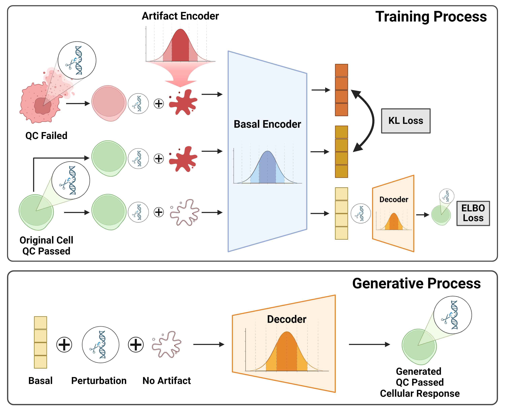

# CRADLE-VAE: Enhancing Single-Cell Gene Perturbation Modeling with Counterfactual Reasoning-based Artifact Disentanglement


## Abstract
Predicting cellular responses to various perturbations is a critical focus in drug discovery and personalized therapeutics, with deep learning models playing a significant role in this endeavor. Single-cell datasets contain technical artifacts that may hinder the predictability of such models, which poses quality control issues highly regarded in this area. To address this, we propose CRADLE-VAE, a causal generative framework tailored for single-cell gene perturbation modeling, enhanced with counterfactual reasoning-based artifact disentanglement. Throughout training, CRADLE-VAE models the underlying latent distribution of technical artifacts and perturbation effects present in single-cell datasets. It employs counterfactual reasoning to effectively disentangle such artifacts by modulating the latent basal spaces and learns robust features for generating cellular response data with improved quality. Experimental results demonstrate that this approach improves not only treatment effect estimation performance but also generative quality as well.

## How to run the experiments
### Prerequisites
This project is tested with following environments:
- Python: 3.9.19
- CUDA: 11.8
- Pytorch-lightning: 2.4.0
- Rapids-singlecell: 0.10.8
- Scanpy: 1.10.2
---
### Install environment (Linux)
```
conda env create --file environment.yml
conda activate cradle_vae_env
```
- If you encounter a conflict, run this command: `conda config --set channel_priority disabled`

```
pip install 'rapids-singlecell[rapids11]' --extra-index-url=https://pypi.nvidia.com #CUDA11.X
pip install 'rapids-singlecell[rapids12]' --extra-index-url=https://pypi.nvidia.com #CUDA12
```
- Install `rapids-singlecell` according to your CUDA version

---
### Download datasets
If you want to annotated dataset when training our model,
```
pip install gdown
gdown https://drive.google.com/uc?id=1OIi1Z3fiw8yKbzarLXMlxy5tJRm1w8Rx # datasets(norman, dixit, replogle, adamson)
tar -zxvf datasets.tar.gz
```
---
### Training models
The easiest way to train a model is specify a config file (eg `demo/cradle_vae_norman.yaml`) with data, model, and training hyperparameters
```
python train_norman.py --config ./demo/cradle_vae_norman.yaml
```
For larger experiments, we provide support for wandb sweeps using redun.
```
pip install redun
bash sweep_norman.sh
```
If you want to run a sweep, you should make the following changes in the `train_{data}.py` script:
- Change the argument defaults: `default=None`
- Comment out the cp line: `# cp.cuda.Device(config['devices'][0]).use()`
- Modify the devices setting in `pl.Trainer`: Set `devices=-1`

---
## Acknowledgement
This code includes modifications based on the code of SAMS-VAE. We are grateful to the authors for providing their code/models as open-source software. And figure was created with BioRender.